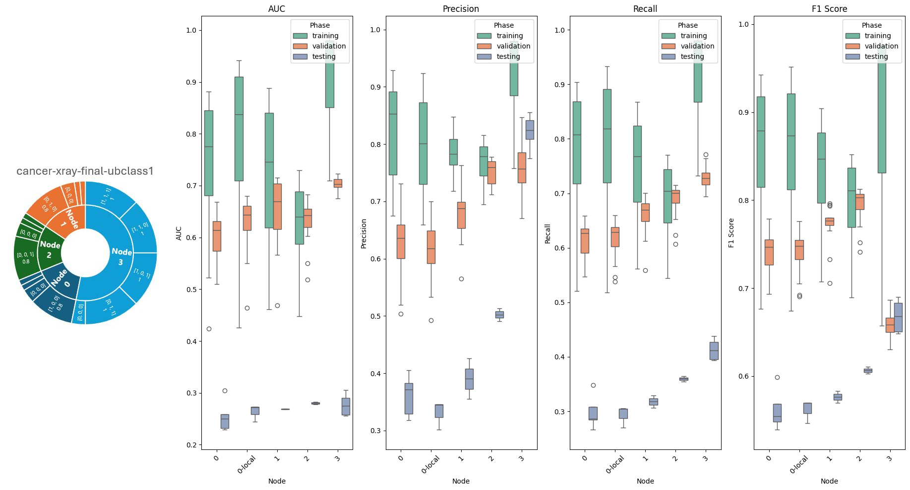

## How to use our research ouput?

Currently we have not pubilished the latest version of our project GitHub, but I have uploaded the defaulted project image in the DockerHub.

Follow the below instructions & try on your own Clusters!

```markdown
docker pull yuji6835/sll_without_dependency
docker run --gpus all -it --net=host <the dockername, like 'yuji6835/sll_without_dependency'> 
```
Then, in the terminal of the container 

```markdown
rye sync -v
direnv allow .envrc
chmod +x .venv/bin/activate
source .venv/bin/activate
# Rewrite the configuration file based on your IP address & feel free to try other VPN channel tools for communication!
1. sll train -c deploy/<task/dataset_name>/configuration file
2. sll train -peer deploy/<task/dataset_name>/configuration file
# we only loaded the the Harvard University's chest x-ray dataset & MNIST in our defaulted dataset, feel free to add & change the model structure!
```


## Abstract of the research 

Nowadays, the deep learning models are prevailing while dealing with complex tasks. However, how to preserve the data privacy becomes a big problem. Our project aims to propose and develop a decentralised model training system in different servers to implement the similar functionaility of centralised training models. 

Swarm learning, a distributed deep learning technique, holds promise for enhancing diagnostic accuracy in cancer pathology. This approach addresses the challenge of data interoperability among nodes by transmitting model parameters without a centralized model, thus mitigating issues arising from data privacy concerns. 

Our research underscores the potential of distributed machine learning frameworks in healthcare, particularly in improving efficiency in data processing, model synchronization protocols, and aggregation methods. These findings pave the way for future technological advancements in medical diagnostics and advocate further exploration into broader impacts and potential avenues for enhancing swarm learning in healthcare.

## Tools and methodologies


For machine learning model training, the project tried several basic modeling frameworks, such as a basic convolutional neural network (CNN) modeling framework or a pre-trained MobileNet model. After comparison and evaluation, TorchXRayVision was selected as the pre-trained model. Pre-training with the Harvard University chest x-ray dataset provided a rich set of basic features for the model. To further optimize the training process, the DenseNet decoder module was added. The following picture shows the whole model training architecture. First, an image with an input size of 224x224 is processed by four 4-layer encoder modules to reduce the dimensionality of the input features from 224x224 to 1024, and then the features are nonlinearly transformed from 1152 dimensions to 512 dimensions by a fully connected layer combining batch normalization and ReLU activation functions. Finally, the final classification task is performed by a fully connected layer from 512 to 3 dimensions, combining batch normalization and sigmoid activation function. The selection and optimization of the model structure helps to improve the performance of the model in the chest X-ray image classification task, ensuring the efficiency and accuracy of feature extraction and classification.


## Results and findings

**Swarm learning models can achieve the same performance levels comparable to centralized learning models.** For both datasets, swarm learning models (Node-0, Node-1, Node-2, and Node-3) outperformed the local training with imbalanced data. For example, Node-0 achieved a Testing AUC of 0.6397±0.0036 compared to Node-0-local's 0.6192±0.0057.

Similarly, the testing AUC for Node-0 is 0.6282±0.0043 compared to Node-0-local's 0.6216±0.0065, demonstrating that even with less data and training sessions, swarm learning framework achieves comparable or better performance.

When compared to simulated centralized full data training, the swarm learning models still shows high performance, indicating robustness. For instance, Node-3 in the same dataset achieved a Testing AUC of 0.6892±0.0063, which is close to the centralized model’s performance.


In both experiments, swarm learning nodes showed relatively high AUROCs, demonstrating consistent performance across different nodes with varying data amounts. This indicates that swarm learning effectively utilizes the distributed data without the need for central model training, achieving comparable results to centralized models. 

Especially when dealing with unbalanced and biased datasets, the effect of swarm learning improves the performance of local servers with small dataset on the unseen or more general testing sets. In scenarios with few and biased datasets, swarm learning models showed superior performance compared to standalone models. This was particularly evident in the second scenario, where the imbalance and scarcity of disease cases posed significant challenges. swarm learning effectively addressed these issues, resulting in more accurate and reliable diagnostic outcomes.



Node-2 with one fourth of the total dataset achieved a Testing AUC of 0.6387 compared to Node-2-local's 0.6259±0.0028, demonstrating improved performance with swarm learning. Such results can also be found in experiments of different model architecture and model aggregation strategies, where there is a slight increase on average Testing AUC values from 0.6367±0.0060 to 0.6404±0.0034.  

Node-2 with one seventh of the whole training set achieved a Testing AUC of 0.6067±0.0020 compared to Node-2-local's 0.5694±0.0058 via the model weight contribution of Node-3, showing the effectiveness of swarm learning in handling biased data. Node-3 with 90\% of NIH images achieved a Testing AUC of 0.6670±0.0186 compared to Node-3-local's 0.6514±0.0116, indicating better performance with swarm learning even for a participant with most of the dataset. Node-3 who has the smallest data entries and the least label combinations achieved a Testing AUC of 0.6237±0.0049, compared to Node-3-local's 0.6197±0.0108, illustrating the reliability of swarm learning even in highly biased scenarios.

The box plots further support these conclusions by showing more concentrated distributions of performance metrics (AUC, Precision, Recall, F1 Score) for the swarm learning models compared to the local models. This concentration of the metric boxes indicates greater consistency and reliability in performance across different phases (training, validation, testing).

**The performance of local servers significantly improves with swarm learning, especially when dealing with unbalanced and biased datasets.** The AUROC metrics and the box plots demonstrate that swarm learning models effectively handle data imbalance and scarcity, resulting in more accurate and reliable diagnostic outcomes compared to standalone models.


Swarm learning helps mitigate overfitting. The line plots for Micro-AUC, F1-Score, Precision, and Recall across multiple experiments demonstrate that swarm learning framework helps mitigate overfitting via the model aggregation between peer nodes. In the experiment 'cancer-xray-fedavg-ubdata', the swarm learning models achieve a steady and gradual increase in AUC, whereas the local model (0-local) shows rapid improvement initially but levels off much earlier. This pattern indicates that swarm learning models achieve better generalization, reducing the risk of overfitting compared to local models. 

**Moreover, the line plots demonstrate that swarm learning models maintain a more stable and consistent improvement in all metrics over epochs.** Swarm learning models often exhibit increases followed by fluctuations which are caused by the model aggregation bewteen peer nodes. The decreased training loss slows the course of overfitting in training sessions. This suggests that swarm learning models are better at maintaining balanced performance on both local and one more general cases (the global testing set), hence mitigate the problem of overfitting.

The Mico-Precision and Micro-Recall line plots in the training phases indicate that swarm learning models achieve higher precision and recall values steadily over time. Local models often show sharp increases followed by plateaus or variability. For instance, Swarm learning models maintain a steady upward trajectory in both metrics, whereas local models like 0-local show rapid improvement followed by stabilization. This steady improvement in precision and recall for swarm learning models exhibits a convergence trend in metrics, which actually reduce overfitting for federated learning. That suggests they are better at minimizing false positives consistently over the training period.