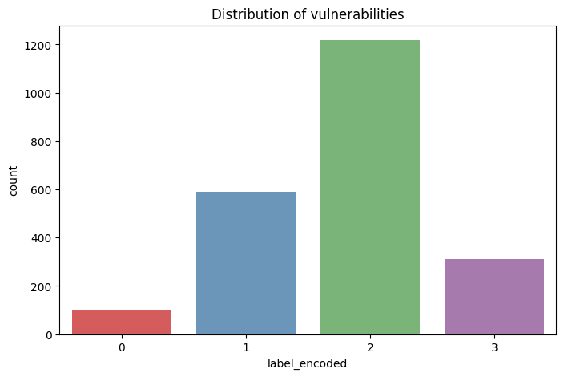
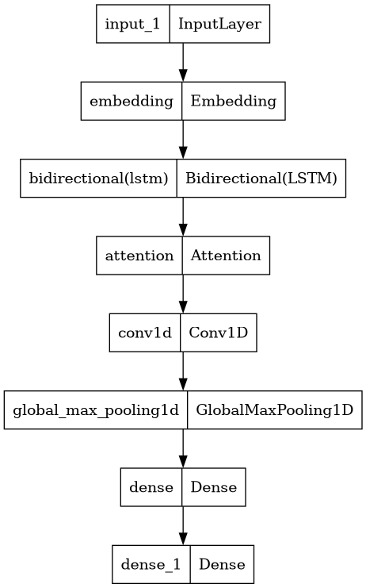
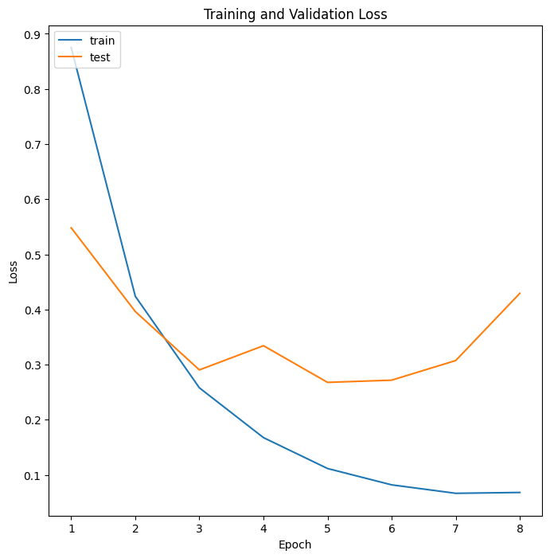
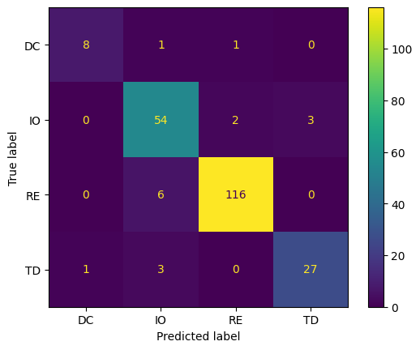
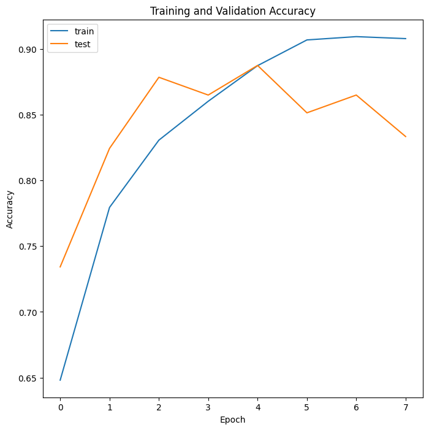
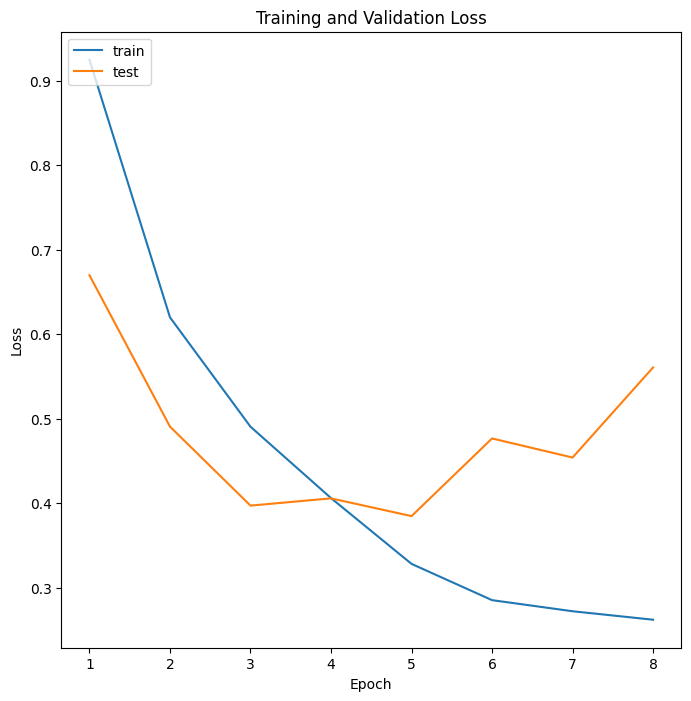
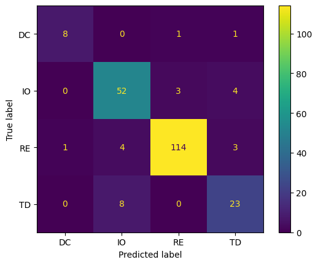

```python
!pip install  keras_core keras_nlp
```

    Requirement already satisfied: keras_core in /opt/conda/lib/python3.10/site-packages (0.1.7)
    Requirement already satisfied: keras_nlp in /opt/conda/lib/python3.10/site-packages (0.7.0)
    Requirement already satisfied: absl-py in /opt/conda/lib/python3.10/site-packages (from keras_core) (1.4.0)
    Requirement already satisfied: numpy in /opt/conda/lib/python3.10/site-packages (from keras_core) (1.24.3)
    Requirement already satisfied: rich in /opt/conda/lib/python3.10/site-packages (from keras_core) (13.5.2)
    Requirement already satisfied: namex in /opt/conda/lib/python3.10/site-packages (from keras_core) (0.0.7)
    Requirement already satisfied: h5py in /opt/conda/lib/python3.10/site-packages (from keras_core) (3.9.0)
    Requirement already satisfied: dm-tree in /opt/conda/lib/python3.10/site-packages (from keras_core) (0.1.8)
    Requirement already satisfied: packaging in /opt/conda/lib/python3.10/site-packages (from keras_nlp) (21.3)
    Requirement already satisfied: regex in /opt/conda/lib/python3.10/site-packages (from keras_nlp) (2023.8.8)
    Requirement already satisfied: kagglehub in /opt/conda/lib/python3.10/site-packages (from keras_nlp) (0.1.5)
    Requirement already satisfied: tensorflow-text in /opt/conda/lib/python3.10/site-packages (from keras_nlp) (2.13.0)
    Requirement already satisfied: requests in /opt/conda/lib/python3.10/site-packages (from kagglehub->keras_nlp) (2.31.0)
    Requirement already satisfied: tqdm in /opt/conda/lib/python3.10/site-packages (from kagglehub->keras_nlp) (4.66.1)
    Requirement already satisfied: pyparsing!=3.0.5,>=2.0.2 in /opt/conda/lib/python3.10/site-packages (from packaging->keras_nlp) (3.0.9)
    Requirement already satisfied: markdown-it-py>=2.2.0 in /opt/conda/lib/python3.10/site-packages (from rich->keras_core) (3.0.0)
    Requirement already satisfied: pygments<3.0.0,>=2.13.0 in /opt/conda/lib/python3.10/site-packages (from rich->keras_core) (2.16.1)
    Requirement already satisfied: tensorflow-hub>=0.8.0 in /opt/conda/lib/python3.10/site-packages (from tensorflow-text->keras_nlp) (0.14.0)
    Requirement already satisfied: tensorflow<2.14,>=2.13.0 in /opt/conda/lib/python3.10/site-packages (from tensorflow-text->keras_nlp) (2.13.0)
    Requirement already satisfied: mdurl~=0.1 in /opt/conda/lib/python3.10/site-packages (from markdown-it-py>=2.2.0->rich->keras_core) (0.1.2)
    Requirement already satisfied: astunparse>=1.6.0 in /opt/conda/lib/python3.10/site-packages (from tensorflow<2.14,>=2.13.0->tensorflow-text->keras_nlp) (1.6.3)
    Requirement already satisfied: flatbuffers>=23.1.21 in /opt/conda/lib/python3.10/site-packages (from tensorflow<2.14,>=2.13.0->tensorflow-text->keras_nlp) (23.5.26)
    Requirement already satisfied: gast<=0.4.0,>=0.2.1 in /opt/conda/lib/python3.10/site-packages (from tensorflow<2.14,>=2.13.0->tensorflow-text->keras_nlp) (0.4.0)
    Requirement already satisfied: google-pasta>=0.1.1 in /opt/conda/lib/python3.10/site-packages (from tensorflow<2.14,>=2.13.0->tensorflow-text->keras_nlp) (0.2.0)
    Requirement already satisfied: grpcio<2.0,>=1.24.3 in /opt/conda/lib/python3.10/site-packages (from tensorflow<2.14,>=2.13.0->tensorflow-text->keras_nlp) (1.51.1)
    Requirement already satisfied: keras<2.14,>=2.13.1 in /opt/conda/lib/python3.10/site-packages (from tensorflow<2.14,>=2.13.0->tensorflow-text->keras_nlp) (2.13.1)
    Requirement already satisfied: libclang>=13.0.0 in /opt/conda/lib/python3.10/site-packages (from tensorflow<2.14,>=2.13.0->tensorflow-text->keras_nlp) (16.0.6)
    Requirement already satisfied: opt-einsum>=2.3.2 in /opt/conda/lib/python3.10/site-packages (from tensorflow<2.14,>=2.13.0->tensorflow-text->keras_nlp) (3.3.0)
    Requirement already satisfied: protobuf!=4.21.0,!=4.21.1,!=4.21.2,!=4.21.3,!=4.21.4,!=4.21.5,<5.0.0dev,>=3.20.3 in /opt/conda/lib/python3.10/site-packages (from tensorflow<2.14,>=2.13.0->tensorflow-text->keras_nlp) (3.20.3)
    Requirement already satisfied: setuptools in /opt/conda/lib/python3.10/site-packages (from tensorflow<2.14,>=2.13.0->tensorflow-text->keras_nlp) (68.1.2)
    Requirement already satisfied: six>=1.12.0 in /opt/conda/lib/python3.10/site-packages (from tensorflow<2.14,>=2.13.0->tensorflow-text->keras_nlp) (1.16.0)
    Requirement already satisfied: tensorboard<2.14,>=2.13 in /opt/conda/lib/python3.10/site-packages (from tensorflow<2.14,>=2.13.0->tensorflow-text->keras_nlp) (2.13.0)
    Requirement already satisfied: tensorflow-estimator<2.14,>=2.13.0 in /opt/conda/lib/python3.10/site-packages (from tensorflow<2.14,>=2.13.0->tensorflow-text->keras_nlp) (2.13.0)
    Requirement already satisfied: termcolor>=1.1.0 in /opt/conda/lib/python3.10/site-packages (from tensorflow<2.14,>=2.13.0->tensorflow-text->keras_nlp) (2.3.0)
    Requirement already satisfied: typing-extensions<4.6.0,>=3.6.6 in /opt/conda/lib/python3.10/site-packages (from tensorflow<2.14,>=2.13.0->tensorflow-text->keras_nlp) (4.5.0)
    Requirement already satisfied: wrapt>=1.11.0 in /opt/conda/lib/python3.10/site-packages (from tensorflow<2.14,>=2.13.0->tensorflow-text->keras_nlp) (1.15.0)
    Requirement already satisfied: tensorflow-io-gcs-filesystem>=0.23.1 in /opt/conda/lib/python3.10/site-packages (from tensorflow<2.14,>=2.13.0->tensorflow-text->keras_nlp) (0.34.0)
    Requirement already satisfied: charset-normalizer<4,>=2 in /opt/conda/lib/python3.10/site-packages (from requests->kagglehub->keras_nlp) (3.2.0)
    Requirement already satisfied: idna<4,>=2.5 in /opt/conda/lib/python3.10/site-packages (from requests->kagglehub->keras_nlp) (3.4)
    Requirement already satisfied: urllib3<3,>=1.21.1 in /opt/conda/lib/python3.10/site-packages (from requests->kagglehub->keras_nlp) (1.26.15)
    Requirement already satisfied: certifi>=2017.4.17 in /opt/conda/lib/python3.10/site-packages (from requests->kagglehub->keras_nlp) (2023.11.17)
    Requirement already satisfied: wheel<1.0,>=0.23.0 in /opt/conda/lib/python3.10/site-packages (from astunparse>=1.6.0->tensorflow<2.14,>=2.13.0->tensorflow-text->keras_nlp) (0.41.2)
    Requirement already satisfied: google-auth<3,>=1.6.3 in /opt/conda/lib/python3.10/site-packages (from tensorboard<2.14,>=2.13->tensorflow<2.14,>=2.13.0->tensorflow-text->keras_nlp) (2.22.0)
    Requirement already satisfied: google-auth-oauthlib<1.1,>=0.5 in /opt/conda/lib/python3.10/site-packages (from tensorboard<2.14,>=2.13->tensorflow<2.14,>=2.13.0->tensorflow-text->keras_nlp) (1.0.0)
    Requirement already satisfied: markdown>=2.6.8 in /opt/conda/lib/python3.10/site-packages (from tensorboard<2.14,>=2.13->tensorflow<2.14,>=2.13.0->tensorflow-text->keras_nlp) (3.4.4)
    Requirement already satisfied: tensorboard-data-server<0.8.0,>=0.7.0 in /opt/conda/lib/python3.10/site-packages (from tensorboard<2.14,>=2.13->tensorflow<2.14,>=2.13.0->tensorflow-text->keras_nlp) (0.7.1)
    Requirement already satisfied: werkzeug>=1.0.1 in /opt/conda/lib/python3.10/site-packages (from tensorboard<2.14,>=2.13->tensorflow<2.14,>=2.13.0->tensorflow-text->keras_nlp) (3.0.1)
    Requirement already satisfied: cachetools<6.0,>=2.0.0 in /opt/conda/lib/python3.10/site-packages (from google-auth<3,>=1.6.3->tensorboard<2.14,>=2.13->tensorflow<2.14,>=2.13.0->tensorflow-text->keras_nlp) (4.2.4)
    Requirement already satisfied: pyasn1-modules>=0.2.1 in /opt/conda/lib/python3.10/site-packages (from google-auth<3,>=1.6.3->tensorboard<2.14,>=2.13->tensorflow<2.14,>=2.13.0->tensorflow-text->keras_nlp) (0.2.7)
    Requirement already satisfied: rsa<5,>=3.1.4 in /opt/conda/lib/python3.10/site-packages (from google-auth<3,>=1.6.3->tensorboard<2.14,>=2.13->tensorflow<2.14,>=2.13.0->tensorflow-text->keras_nlp) (4.9)
    Requirement already satisfied: requests-oauthlib>=0.7.0 in /opt/conda/lib/python3.10/site-packages (from google-auth-oauthlib<1.1,>=0.5->tensorboard<2.14,>=2.13->tensorflow<2.14,>=2.13.0->tensorflow-text->keras_nlp) (1.3.1)
    Requirement already satisfied: MarkupSafe>=2.1.1 in /opt/conda/lib/python3.10/site-packages (from werkzeug>=1.0.1->tensorboard<2.14,>=2.13->tensorflow<2.14,>=2.13.0->tensorflow-text->keras_nlp) (2.1.3)
    Requirement already satisfied: pyasn1<0.5.0,>=0.4.6 in /opt/conda/lib/python3.10/site-packages (from pyasn1-modules>=0.2.1->google-auth<3,>=1.6.3->tensorboard<2.14,>=2.13->tensorflow<2.14,>=2.13.0->tensorflow-text->keras_nlp) (0.4.8)
    Requirement already satisfied: oauthlib>=3.0.0 in /opt/conda/lib/python3.10/site-packages (from requests-oauthlib>=0.7.0->google-auth-oauthlib<1.1,>=0.5->tensorboard<2.14,>=2.13->tensorflow<2.14,>=2.13.0->tensorflow-text->keras_nlp) (3.2.2)

```python
import os
import matplotlib.pyplot as plt
import tensorflow as tf
from sklearn.preprocessing import LabelEncoder
from sklearn.model_selection import train_test_split
from collections import Counter
from keras.preprocessing.text import Tokenizer
from keras.utils import pad_sequences
from keras.preprocessing.text import Tokenizer
from keras.utils import pad_sequences
from keras.utils import to_categorical
from keras.models import Sequential, Model
from keras.layers import Dense,Dropout,Input,Embedding,Flatten,TextVectorization,Conv1D,GlobalMaxPooling1D,MaxPooling1D,GlobalAveragePooling1D
from keras.initializers import Constant
from keras.layers import Dense,LSTM,Bidirectional,Attention,Concatenate,GRU,BatchNormalization
import nltk
from nltk.corpus import stopwords
import re
import seaborn as sns
nltk.download('stopwords')
```

    /opt/conda/lib/python3.10/site-packages/scipy/__init__.py:146: UserWarning: A NumPy version >=1.16.5 and <1.23.0 is required for this version of SciPy (detected version 1.24.3
      warnings.warn(f"A NumPy version >={np_minversion} and <{np_maxversion}"

    [nltk_data] Downloading package stopwords to /usr/share/nltk_data...
    [nltk_data]   Package stopwords is already up-to-date!

    True

```python
# Enable multiple gpus
gpus = tf.config.list_physical_devices('GPU')
if len(gpus)<=1: 
    strategy = tf.distribute.OneDeviceStrategy(device="/gpu:0")
    print(f'Using {len(gpus)} GPU')
else: 
    strategy = tf.distribute.MirroredStrategy()
    print(f'Using {len(gpus)} GPUs')
```

    Using 2 GPUs

```python
import pandas as pd
import numpy as np
data=pd.read_csv('/kaggle/input/smart-contract-vulnerability-datset/SC_4label.csv')
data
```

<div>
<style scoped>
    .dataframe tbody tr th:only-of-type {
        vertical-align: middle;
    }

    .dataframe tbody tr th {
        vertical-align: top;
    }

    .dataframe thead th {
        text-align: right;
    }
</style>
<table border="1" class="dataframe">
  <thead>
    <tr style="text-align: right;">
      <th></th>
      <th>Unnamed: 0</th>
      <th>filename</th>
      <th>code</th>
      <th>label</th>
      <th>label_encoded</th>
    </tr>
  </thead>
  <tbody>
    <tr>
      <th>0</th>
      <td>0</td>
      <td>36375.sol</td>
      <td>pragma solidity ^0.4.15;\n\n/*\n\n    CJX.io -...</td>
      <td>/content/drive/My Drive/SC_Dataset/reentrancy ...</td>
      <td>2</td>
    </tr>
    <tr>
      <th>1</th>
      <td>1</td>
      <td>40298.sol</td>
      <td>// &lt;ORACLIZE_API&gt;\n/*\nCopyright (c) 2015-2016...</td>
      <td>/content/drive/My Drive/SC_Dataset/reentrancy ...</td>
      <td>2</td>
    </tr>
    <tr>
      <th>2</th>
      <td>2</td>
      <td>39858.sol</td>
      <td>pragma solidity ^0.4.6;\n\n/*\n    Copyright 2...</td>
      <td>/content/drive/My Drive/SC_Dataset/reentrancy ...</td>
      <td>2</td>
    </tr>
    <tr>
      <th>3</th>
      <td>3</td>
      <td>34598.sol</td>
      <td>pragma solidity ^0.4.4;\n\ncontract Token {\n\...</td>
      <td>/content/drive/My Drive/SC_Dataset/reentrancy ...</td>
      <td>2</td>
    </tr>
    <tr>
      <th>4</th>
      <td>4</td>
      <td>33490.sol</td>
      <td>pragma solidity ^0.4.13;\n\ncontract DSAuthori...</td>
      <td>/content/drive/My Drive/SC_Dataset/reentrancy ...</td>
      <td>2</td>
    </tr>
    <tr>
      <th>...</th>
      <td>...</td>
      <td>...</td>
      <td>...</td>
      <td>...</td>
      <td>...</td>
    </tr>
    <tr>
      <th>2212</th>
      <td>2212</td>
      <td>9695.sol</td>
      <td>\ncontract ERC223ReceivingContract {\n\n     ...</td>
      <td>/content/drive/My Drive/SC_Dataset/timestamp d...</td>
      <td>3</td>
    </tr>
    <tr>
      <th>2213</th>
      <td>2213</td>
      <td>8615.sol</td>
      <td>pragma solidity ^0.4.13;\n\ncontract ERC20Basi...</td>
      <td>/content/drive/My Drive/SC_Dataset/timestamp d...</td>
      <td>3</td>
    </tr>
    <tr>
      <th>2214</th>
      <td>2214</td>
      <td>7877.sol</td>
      <td>pragma solidity ^0.4.24;\npragma experimental ...</td>
      <td>/content/drive/My Drive/SC_Dataset/timestamp d...</td>
      <td>3</td>
    </tr>
    <tr>
      <th>2215</th>
      <td>2215</td>
      <td>6604.sol</td>
      <td>pragma solidity 0.4.24;\n\n \n\n \nlibrary Saf...</td>
      <td>/content/drive/My Drive/SC_Dataset/timestamp d...</td>
      <td>3</td>
    </tr>
    <tr>
      <th>2216</th>
      <td>2216</td>
      <td>401.sol</td>
      <td>pragma solidity ^0.4.20;\n\ncontract EVOLUTION...</td>
      <td>/content/drive/My Drive/SC_Dataset/timestamp d...</td>
      <td>3</td>
    </tr>
  </tbody>
</table>
<p>2217 rows × 5 columns</p>
</div>

# Label distribution

```python
data['label_encoded'].value_counts()
```

    label_encoded
    2    1218
    1     590
    3     312
    0      97
    Name: count, dtype: int64

```python
plt.figure(figsize = (8,5))
sns.countplot(x = data['label_encoded'], palette = 'Set1', alpha = 0.8)
plt.title('Distribution of vulnerabilities')
```

    Text(0.5, 1.0, 'Distribution of vulnerabilities')

    

    

# Preprocessing dataset

```python
X = data['code']
y = data['label_encoded']
```

```python
solidity_stopwords = [
    "pragma", "interface", "contract", "function", "event", "modifier", "library", "using",
    "string", "uint8", "uint256", "address", "mapping", "bool", "require", "return", "memory",
    "storage", "public", "internal", "view", "returns", "constant", "constructor",
    "_owner", "_balances", "_allowances", "_founder", "_marketing", "_who", "_burntAmount",
    "_from", "_to", "_value", "_timestamp", "_bool", "msg.sender", "totalSupply",
    "balanceOf", "transfer", "allowance", "approve", "transferFrom", "add", "sub", "mul", "div",
    "mod", "changeFounder", "setMinter", "setFurnace", "freezeAccount","solidity","bytes32"
]
def clean_solidity_code(solidity_code):
    # Remove comments (both single-line and multi-line)
    cleaned_code = re.sub(r'//.*?$', '', solidity_code, flags=re.MULTILINE)
    cleaned_code = re.sub(r'/\*.*?\*/', '', cleaned_code, flags=re.DOTALL)

    # Remove special characters and punctuation
    cleaned_code = re.sub(r'[^a-zA-Z0-9\s]', '', cleaned_code)

    # Remove extra whitespace and blank lines, and convert to lowercase
    cleaned_code = '\n'.join(line.strip().lower() for line in cleaned_code.splitlines() if line.strip())

    # Remove common English stop words
    stop_words = set(stopwords.words('english'))
    tokens = [word for word in cleaned_code.split() if word not in stop_words]
    tokens = [token for token in tokens if token not in solidity_stopwords]
    cleaned_code = ' '.join(tokens)

    return tokens
```

```python
X_cleaned = X.apply(clean_solidity_code)
```

```python
# Join the tokenized words back into sentences
X_cleaned_sentences = [' '.join(doc) for doc in X_cleaned]
```

```python
X_cleaned_sentences=np.array(X_cleaned_sentences)
```

```python
X_cleaned_sentences[1]
```

    'oraclizei cbaddress queryuint timestamp datasource arg id querywithgaslimituint timestamp datasource arg uint gaslimit id query2uint timestamp datasource arg1 arg2 id query2withgaslimituint timestamp datasource arg1 arg2 uint gaslimit id getpricestring datasource uint dsprice getpricestring datasource uint gaslimit uint dsprice usecouponstring coupon setprooftypebyte prooftype setcustomgaspriceuint gasprice oraclizeaddrresolveri getaddress addr usingoraclize uint day 606024 uint week 6060247 uint month 60602430 byte prooftypenone 0x00 byte prooftypetlsnotary 0x10 byte proofstorageipfs 0x01 networkidauto 0 networkidmainnet 1 networkidtestnet 2 networkidmorden 2 networkidconsensys 161 oraclizeaddrresolveri oar oraclizei oraclize oraclizeapi oraclizeaddr oargetaddress oraclizeaddr 0 oraclizesetnetworknetworkidauto oraclizeaddr oargetaddress oraclize oraclizeioraclizeaddr couponstring code oraclize oraclizeioargetaddress oraclizeusecouponcode oraclizesetnetworkuint8 networkid returnsbool getcodesize0x1d3b2638a7cc9f2cb3d298a3da7a90b67e5506ed0 oar oraclizeaddrresolveri0x1d3b2638a7cc9f2cb3d298a3da7a90b67e5506ed true getcodesize0x9efbea6358bed926b293d2ce63a730d6d98d43dd0 oar oraclizeaddrresolveri0x9efbea6358bed926b293d2ce63a730d6d98d43dd true getcodesize0x20e12a1f859b3feae5fb2a0a32c18f5a65555bbf0 oar oraclizeaddrresolveri0x20e12a1f859b3feae5fb2a0a32c18f5a65555bbf true false oraclizequerystring datasource arg oraclizeapi id uint price oraclizegetpricedatasource price 1 ether txgasprice200000 0 oraclizequeryvalueprice0 datasource arg oraclizequeryuint timestamp datasource arg oraclizeapi id uint price oraclizegetpricedatasource price 1 ether txgasprice200000 0 oraclizequeryvaluepricetimestamp datasource arg oraclizequeryuint timestamp datasource arg uint gaslimit oraclizeapi id uint price oraclizegetpricedatasource gaslimit price 1 ether txgaspricegaslimit 0 oraclizequerywithgaslimitvaluepricetimestamp datasource arg gaslimit oraclizequerystring datasource arg uint gaslimit oraclizeapi id uint price oraclizegetpricedatasource gaslimit price 1 ether txgaspricegaslimit 0 oraclizequerywithgaslimitvalueprice0 datasource arg gaslimit oraclizequerystring datasource arg1 arg2 oraclizeapi id uint price oraclizegetpricedatasource price 1 ether txgasprice200000 0 oraclizequery2valueprice0 datasource arg1 arg2 oraclizequeryuint timestamp datasource arg1 arg2 oraclizeapi id uint price oraclizegetpricedatasource price 1 ether txgasprice200000 0 oraclizequery2valuepricetimestamp datasource arg1 arg2 oraclizequeryuint timestamp datasource arg1 arg2 uint gaslimit oraclizeapi id uint price oraclizegetpricedatasource gaslimit price 1 ether txgaspricegaslimit 0 oraclizequery2withgaslimitvaluepricetimestamp datasource arg1 arg2 gaslimit oraclizequerystring datasource arg1 arg2 uint gaslimit oraclizeapi id uint price oraclizegetpricedatasource gaslimit price 1 ether txgaspricegaslimit 0 oraclizequery2withgaslimitvalueprice0 datasource arg1 arg2 gaslimit oraclizecbaddress oraclizeapi oraclizecbaddress oraclizesetproofbyte proofp oraclizeapi oraclizesetprooftypeproofp oraclizesetcustomgaspriceuint gasprice oraclizeapi oraclizesetcustomgaspricegasprice getcodesizeaddress addr returnsuint size assembly size extcodesizeaddr parseaddrstring bytes tmp bytesa uint160 iaddr 0 uint160 b1 uint160 b2 uint i2 i2220 i2 iaddr 256 b1 uint160tmpi b2 uint160tmpi1 b1 97b1 102 b1 87 else b1 48b1 57 b1 48 b2 97b2 102 b2 87 else b2 48b2 57 b2 48 iaddr b116b2 addressiaddr strcomparestring b int bytes bytesa bytes b bytesb uint minlength alength blength minlength minlength blength uint 0 minlength ai bi 1 else ai bi 1 alength blength 1 else alength blength 1 else 0 indexofstring haystack needle int bytes h byteshaystack bytes n bytesneedle ifhlength 1 nlength 1 nlength hlength 1 else ifhlength 2128 1 1 else uint subindex 0 uint 0 hlength hi n0 subindex 1 whilesubindex nlength subindex hlength hi subindex nsubindex subindex ifsubindex nlength inti 1 strconcatstring b c e bytes ba bytesa bytes bb bytesb bytes bc bytesc bytes bd bytesd bytes bytese abcde new stringbalength bblength bclength bdlength belength bytes babcde bytesabcde uint k 0 uint 0 balength babcdek bai 0 bblength babcdek bbi 0 bclength babcdek bci 0 bdlength babcdek bdi 0 belength babcdek bei stringbabcde strconcatstring b c strconcata b c strconcatstring b c strconcata b c strconcatstring b strconcata b parseintstring uint parseinta 0 parseintstring uint b uint bytes bresult bytesa uint mint 0 decimals false uint i0 ibresultlength bresulti 48bresulti 57 decimals b 0 break else b mint 10 mint uintbresulti 48 else bresulti 46 decimals true b 0 mint 10b mint dice usingoraclize uint pwin 5000 uint edge 200 uint maxwin 100 uint minbet 1 finney uint maxinvestors 5 uint houseedge 50 uint divestfee 50 uint emergencywithdrawalratio 90 uint safegas 25000 uint oraclizegaslimit 125000 uint invalidbetmarker 99999 uint emergencytimeout 7 days struct investor investoraddress uint amountinvested votedforemergencywithdrawal struct bet playeraddress uint amountbetted uint numberrolled struct withdrawalproposal toaddress uint attime mappingaddress uint investorids mappinguint investor investors uint numinvestors 0 uint invested 0 owner houseaddress isstopped withdrawalproposal proposedwithdrawal bet bets betskeys uint amountwagered 0 uint investorsprofit 0 uint investorsloses 0 profitdistributed betwonaddress playeraddress uint numberrolled uint amountwon betlostaddress playeraddress uint numberrolled emergencywithdrawalproposed emergencywithdrawalfailedaddress withdrawaladdress emergencywithdrawalsucceededaddress withdrawaladdress uint amountwithdrawn failedsendaddress receiver uint amount valueistoobig diceuint pwininitial uint edgeinitial uint maxwininitial uint minbetinitial uint maxinvestorsinitial uint houseedgeinitial uint divestfeeinitial uint emergencywithdrawalratioinitial oraclizesetproofprooftypetlsnotary proofstorageipfs pwin pwininitial edge edgeinitial maxwin maxwininitial minbet minbetinitial maxinvestors maxinvestorsinitial houseedge houseedgeinitial divestfee divestfeeinitial emergencywithdrawalratio emergencywithdrawalratioinitial owner msgsender houseaddress msgsender onlyifnotstopped isstopped throw onlyifstopped isstopped throw onlyinvestors investoridsmsgsender 0 throw onlynotinvestors investoridsmsgsender 0 throw onlyowner owner msgsender throw onlyoraclize msgsender oraclizecbaddress throw onlymorethanmininvestment msgvalue getmininvestment throw onlymorethanzero msgvalue 0 throw onlyifbetsizeisstillcorrectbytes32 myid bet thisbet betsmyid thisbetamountbetted 10000 edge pwin pwin maxwin getbankroll 10000 else betsmyidnumberrolled invalidbetmarker safesendthisbetplayeraddress thisbetamountbetted onlyifvalidrollbytes32 myid result bet thisbet betsmyid uint numberrolled parseintresult numberrolled 1 numberrolled 10000 thisbetnumberrolled 0 betsmyidnumberrolled invalidbetmarker safesendthisbetplayeraddress thisbetamountbetted onlyifinvestorbalanceispositiveaddress currentinvestor getbalancecurrentinvestor 0 onlywinningbetsuint numberrolled numberrolled 1 pwin onlylosingbetsuint numberrolled numberrolled 1 pwin onlyafterproposed proposedwithdrawaltoaddress 0 throw rejectvalue msgvalue 0 throw onlyifprofitnotdistributed profitdistributed onlyifvalidgasuint newgaslimit newgaslimit 25000 throw onlyifnotprocessedbytes32 myid bet thisbet betsmyid thisbetnumberrolled 0 throw onlyifemergencytimeouthaspassed proposedwithdrawalattime emergencytimeout throw getbankroll returnsuint invested investorsprofit investorsloses getmininvestment returnsuint numinvestors maxinvestors uint investorid searchsmallestinvestor getbalanceinvestorsinvestoridinvestoraddress else 0 getstatus returnsuint uint uint uint uint uint uint uint uint uint bankroll getbankroll uint mininvestment getmininvestment bankroll pwin edge maxwin minbet amountwagered investorsprofit investorsloses mininvestment betskeyslength getbetuint id returnsaddress uint uint id betskeyslength betkey betskeysid betsbetkeyplayeraddress betsbetkeyamountbetted betsbetkeynumberrolled numbets returnsuint betskeyslength getminbetamount returnsuint uint oraclizefee oraclizeioargetaddressgetpriceurl oraclizegaslimit safegas oraclizefee minbet getmaxbetamount returnsuint uint oraclizefee oraclizeioargetaddressgetpriceurl oraclizegaslimit safegas uint betvalue maxwin getbankroll pwin 10000 10000 edge pwin betvalue oraclizefee getlosesshareaddress currentinvestor uint investorsinvestoridscurrentinvestoramountinvested investorsloses invested getprofitshareaddress currentinvestor uint investorsinvestoridscurrentinvestoramountinvested investorsprofit invested getbalanceaddress currentinvestor uint investorsinvestoridscurrentinvestoramountinvested getprofitsharecurrentinvestor getlosessharecurrentinvestor searchsmallestinvestor returnsuint uint investorid 1 uint 1 numinvestors getbalanceinvestorsiinvestoraddress getbalanceinvestorsinvestoridinvestoraddress investorid investorid safesendaddress addr uint value private thisbalance value valueistoobig addrcallgassafegasvaluevalue failedsendaddr value addr houseaddress houseaddresscallgassafegasvaluevalue failedsendhouseaddress value addinvestoratiduint id private investoridsmsgsender id investorsidinvestoraddress msgsender investorsidamountinvested msgvalue invested msgvalue profitdistribution private onlyifprofitnotdistributed uint copyinvested uint 1 numinvestors currentinvestor investorsiinvestoraddress uint profitofinvestor getprofitsharecurrentinvestor uint losesofinvestor getlosessharecurrentinvestor investorsiamountinvested profitofinvestor losesofinvestor copyinvested investorsiamountinvested delete investorsprofit delete investorsloses invested copyinvested profitdistributed true bet bet onlyifnotstopped onlymorethanzero uint oraclizefee oraclizeioargetaddressgetpriceurl oraclizegaslimit safegas uint betvalue msgvalue oraclizefee betvalue 10000 edge pwin pwin maxwin getbankroll 10000 betvalue minbet myid oraclizequeryurl jsonhttps betsmyid betmsgsender betvalue 0 betskeyspushmyid else throw callback myid result bytes proof onlyoraclize onlyifnotprocessedmyid onlyifvalidrollmyid result onlyifbetsizeisstillcorrectmyid bet thisbet betsmyid uint numberrolled parseintresult betsmyidnumberrolled numberrolled iswinningbetthisbet numberrolled islosingbetthisbet numberrolled amountwagered thisbetamountbetted delete profitdistributed iswinningbetbet thisbet uint numberrolled private onlywinningbetsnumberrolled uint winamount thisbetamountbetted 10000 edge pwin betwonthisbetplayeraddress numberrolled winamount safesendthisbetplayeraddress winamount investorsloses winamount thisbetamountbetted islosingbetbet thisbet uint numberrolled private onlylosingbetsnumberrolled betlostthisbetplayeraddress numberrolled safesendthisbetplayeraddress 1 investorsprofit thisbetamountbetted 110000 houseedge10000 uint houseprofit thisbetamountbetted 1houseedge10000 safesendhouseaddress houseprofit increaseinvestment onlyifnotstopped onlymorethanzero onlyinvestors profitdistribution investorsinvestoridsmsgsenderamountinvested msgvalue invested msgvalue newinvestor onlyifnotstopped onlymorethanzero onlynotinvestors onlymorethanmininvestment profitdistribution numinvestors maxinvestors uint smallestinvestorid searchsmallestinvestor divestinvestorssmallestinvestoridinvestoraddress numinvestors addinvestoratidnuminvestors divest onlyinvestors rejectvalue divestmsgsender divestaddress currentinvestor private onlyifinvestorbalanceispositivecurrentinvestor profitdistribution uint currentid investoridscurrentinvestor uint amounttoreturn getbalancecurrentinvestor invested investorscurrentidamountinvested uint divestfeeamount amounttoreturndivestfee10000 amounttoreturn divestfeeamount delete investorscurrentid delete investoridscurrentinvestor currentid numinvestors investor lastinvestor investorsnuminvestors investoridslastinvestorinvestoraddress currentid investorscurrentid lastinvestor delete investorsnuminvestors numinvestors safesendcurrentinvestor amounttoreturn safesendhouseaddress divestfeeamount forcedivestofallinvestors onlyowner rejectvalue uint copynuminvestors numinvestors uint 1 copynuminvestors divestinvestors1investoraddress forcedivestofoneinvestoraddress currentinvestor onlyowner onlyifstopped rejectvalue divestcurrentinvestor delete proposedwithdrawal stopcontract onlyowner rejectvalue isstopped true resumecontract onlyowner rejectvalue isstopped false changehouseaddressaddress newhouse onlyowner rejectvalue houseaddress newhouse changeowneraddressaddress newowner onlyowner rejectvalue owner newowner changegaslimitofsafesenduint newgaslimit onlyowner onlyifvalidgasnewgaslimit rejectvalue safegas newgaslimit voteemergencywithdrawalbool vote onlyinvestors onlyafterproposed onlyifstopped rejectvalue investorsinvestoridsmsgsendervotedforemergencywithdrawal vote proposeemergencywithdrawaladdress withdrawaladdress onlyifstopped onlyowner rejectvalue uint 1 numinvestors delete investorsivotedforemergencywithdrawal proposedwithdrawal withdrawalproposalwithdrawaladdress emergencywithdrawalproposed executeemergencywithdrawal onlyowner onlyafterproposed onlyifstopped onlyifemergencytimeouthaspassed rejectvalue uint numofvotesinfavour uint amounttowithdrawal thisbalance uint 1 numinvestors investorsivotedforemergencywithdrawal true numofvotesinfavour delete investorsivotedforemergencywithdrawal numofvotesinfavour emergencywithdrawalratio numinvestors 100 proposedwithdrawaltoaddresssendthisbalance emergencywithdrawalfailedproposedwithdrawaltoaddress else emergencywithdrawalsucceededproposedwithdrawaltoaddress amounttowithdrawal else throw'

```python
#Data splitting
X_train, X_test, y_train, y_test = train_test_split(X_cleaned_sentences, y,
                                                    test_size=0.1,shuffle=True,random_state=42,stratify=y)
```

# Tokenize and padding

```python
# one hot encoding label
y_train_encoded = to_categorical(y_train, 4)
y_test_encoded = to_categorical(y_test, 4)
y_train_encoded
```

    array([[0., 0., 1., 0.],
           [0., 1., 0., 0.],
           [0., 0., 1., 0.],
           ...,
           [1., 0., 0., 0.],
           [0., 0., 0., 1.],
           [0., 0., 1., 0.]], dtype=float32)

```python
# Tokenize the text data
tokenizer = Tokenizer()
tokenizer.fit_on_texts(X_train)
X_train_sequences = tokenizer.texts_to_sequences(X_train)
X_test_sequences = tokenizer.texts_to_sequences(X_test)
```

```python
# Padding the sequences
X_train_padded = pad_sequences(X_train_sequences, maxlen=128, padding='post', truncating='post')
X_test_padded = pad_sequences(X_test_sequences, maxlen=128, padding='post', truncating='post')
```

```python
print('Shape of training tensor: ', X_train_padded.shape)
print('Shape of testing tensor: ', X_test_padded.shape)
```

    Shape of training tensor:  (1995, 128)
    Shape of testing tensor:  (222, 128)

# Optional: Oversampling dataset using SMOTE

```python
#Smote oversampling
from imblearn.over_sampling import SMOTE
from imblearn.over_sampling import BorderlineSMOTE
import math
```

```python
def smote(x, y):
    k_neighbors = math.ceil(sum(y) * 0.01)
      
    smote = SMOTE(sampling_strategy=1, 
                  k_neighbors=k_neighbors)
    x, y = smote.fit_resample(x, y)
    
    return x, y
    
def bordersmote(x, y):
    k_neighbors = math.ceil(sum(y) * 0.01)
    m_neighbors = math.ceil(sum(y) * 0.01)
    
    bordersmote = BorderlineSMOTE(sampling_strategy=1, 
                                  k_neighbors=k_neighbors, 
                                  m_neighbors=m_neighbors)
    
    x, y = bordersmote.fit_resample(x, y)
    
    return x, y
```

```python
smote = SMOTE(sampling_strategy='minority', random_state=42)
X_train_resampled, y_train_resampled = smote.fit_resample(X_train_padded, y_train_encoded)
```

```python
y_train_resampled
```

    array([[0, 0, 1, 0],
           [0, 1, 0, 0],
           [0, 0, 1, 0],
           ...,
           [1, 0, 0, 0],
           [1, 0, 0, 0],
           [1, 0, 0, 0]])

```python
label_counts = np.sum(y_train_resampled, axis=0)

# Display the label counts
print("Label Counts:", label_counts)
```

    Label Counts: [1096  531 1096  281]

```python
#getting the length of the maximum sequence in the dataset
max_length = max([len(w) for w in X_train])
print(max_length)
```

    40222

```python
emb_len=len(tokenizer.index_word)+1
```

# Attention based BiLSTM CNN

```python
# Input layer
input_layer = Input(shape=(128,))  # Specify max_len as the maximum sequence length

# Embedding layer
embedding_layer = Embedding(emb_len, 128)(input_layer)

# Bidirectional LSTM layer replaced with Attention layer
lstm_layer = Bidirectional(LSTM(128, return_sequences=True, dropout=0.2, recurrent_dropout=0.3))(embedding_layer)
attention = Attention()([lstm_layer, lstm_layer])  # Attention layer

# 1D Convolutional layer
conv1d_layer = Conv1D(64, kernel_size=3, activation='relu')(attention)

# GlobalMaxPooling1D layer
global_max_pooling_layer = GlobalMaxPooling1D()(conv1d_layer)

# Dense layers
dense_layer_1 = Dense(128, activation='relu')(global_max_pooling_layer)

output_layer = Dense(4, activation='softmax')(dense_layer_1)

# Model creation
model = Model(inputs=input_layer, outputs=output_layer)
```

```python
model.summary()
```

    Model: "model"
    __________________________________________________________________________________________________
     Layer (type)                Output Shape                 Param #   Connected to                  
    ==================================================================================================
     input_1 (InputLayer)        [(None, 128)]                0         []                            
                                                                                                      
     embedding (Embedding)       (None, 128, 128)             5820160   ['input_1[0][0]']             
                                                                                                      
     bidirectional (Bidirection  (None, 128, 256)             263168    ['embedding[0][0]']           
     al)                                                                                              
                                                                                                      
     attention (Attention)       (None, 128, 256)             0         ['bidirectional[0][0]',       
                                                                         'bidirectional[0][0]']       
                                                                                                      
     conv1d (Conv1D)             (None, 126, 64)              49216     ['attention[0][0]']           
                                                                                                      
     global_max_pooling1d (Glob  (None, 64)                   0         ['conv1d[0][0]']              
     alMaxPooling1D)                                                                                  
                                                                                                      
     dense (Dense)               (None, 128)                  8320      ['global_max_pooling1d[0][0]']
                                                                                                      
     dense_1 (Dense)             (None, 4)                    516       ['dense[0][0]']               
                                                                                                      
    ==================================================================================================
    Total params: 6141380 (23.43 MB)
    Trainable params: 6141380 (23.43 MB)
    Non-trainable params: 0 (0.00 Byte)
    __________________________________________________________________________________________________

```python
tf.keras.utils.plot_model(model)
```

    

    

```python
model.compile(optimizer='adam',loss='categorical_crossentropy',metrics=['accuracy'])
```

```python
checkpoint_path = 'training/best_model.ckpt'
checkpoint_dir = os.path.dirname(checkpoint_path)
model_checkpoint_callback = tf.keras.callbacks.ModelCheckpoint(
    filepath=checkpoint_path,
    monitor='val_accuracy',
    mode='max',
    save_best_only=True,
    verbose=1)
```

```python
from keras.callbacks import EarlyStopping
from keras.callbacks import ReduceLROnPlateau
reduce_lr = ReduceLROnPlateau(monitor='val_loss', factor=0.2, patience=3, min_lr=0.00001)
early_stop = EarlyStopping(monitor='val_loss',patience=3,verbose=True)
```

```python
#Trainig the model
history = model.fit(X_train_padded,y_train_encoded,
                    batch_size=32,
                    epochs=20,
                    validation_data=(X_test_padded,y_test_encoded),
                    callbacks=[model_checkpoint_callback,early_stop])
```

    Epoch 1/20
    63/63 [==============================] - ETA: 0s - loss: 0.8750 - accuracy: 0.6331
    Epoch 1: val_accuracy improved from -inf to 0.78378, saving model to training/best_model.ckpt
    63/63 [==============================] - 80s 1s/step - loss: 0.8750 - accuracy: 0.6331 - val_loss: 0.5482 - val_accuracy: 0.7838
    Epoch 2/20
    63/63 [==============================] - ETA: 0s - loss: 0.4240 - accuracy: 0.8551
    Epoch 2: val_accuracy improved from 0.78378 to 0.85586, saving model to training/best_model.ckpt
    63/63 [==============================] - 67s 1s/step - loss: 0.4240 - accuracy: 0.8551 - val_loss: 0.3963 - val_accuracy: 0.8559
    Epoch 3/20
    63/63 [==============================] - ETA: 0s - loss: 0.2580 - accuracy: 0.9188
    Epoch 3: val_accuracy improved from 0.85586 to 0.90541, saving model to training/best_model.ckpt
    63/63 [==============================] - 65s 1s/step - loss: 0.2580 - accuracy: 0.9188 - val_loss: 0.2905 - val_accuracy: 0.9054
    Epoch 4/20
    63/63 [==============================] - ETA: 0s - loss: 0.1677 - accuracy: 0.9474
    Epoch 4: val_accuracy did not improve from 0.90541
    63/63 [==============================] - 56s 888ms/step - loss: 0.1677 - accuracy: 0.9474 - val_loss: 0.3343 - val_accuracy: 0.8874
    Epoch 5/20
    63/63 [==============================] - ETA: 0s - loss: 0.1116 - accuracy: 0.9629
    Epoch 5: val_accuracy did not improve from 0.90541
    63/63 [==============================] - 54s 862ms/step - loss: 0.1116 - accuracy: 0.9629 - val_loss: 0.2678 - val_accuracy: 0.9009
    Epoch 6/20
    63/63 [==============================] - ETA: 0s - loss: 0.0820 - accuracy: 0.9709
    Epoch 6: val_accuracy improved from 0.90541 to 0.92342, saving model to training/best_model.ckpt
    63/63 [==============================] - 62s 987ms/step - loss: 0.0820 - accuracy: 0.9709 - val_loss: 0.2718 - val_accuracy: 0.9234
    Epoch 7/20
    63/63 [==============================] - ETA: 0s - loss: 0.0667 - accuracy: 0.9769
    Epoch 7: val_accuracy did not improve from 0.92342
    63/63 [==============================] - 55s 874ms/step - loss: 0.0667 - accuracy: 0.9769 - val_loss: 0.3075 - val_accuracy: 0.9189
    Epoch 8/20
    63/63 [==============================] - ETA: 0s - loss: 0.0682 - accuracy: 0.9744
    Epoch 8: val_accuracy did not improve from 0.92342
    63/63 [==============================] - 52s 824ms/step - loss: 0.0682 - accuracy: 0.9744 - val_loss: 0.4294 - val_accuracy: 0.9009
    Epoch 8: early stopping

```python
#Load best model
model.load_weights(checkpoint_path)
```

    <tensorflow.python.checkpoint.checkpoint.CheckpointLoadStatus at 0x7e186b38d840>

```python
def plot_metrics(history, metric):
    train_metric = history.history[metric]
    val_metric = history.history[f'val_{metric}']
    epochs = range(1, len(train_metric)+1)

    plt.figure(figsize=(8,8))
    plt.plot(epochs,train_metric,label = f'Training {metric}')
    plt.plot(epochs,val_metric,label = f'Validation {metric}')
    plt.title(f'Training and Validation {metric.capitalize()}')
    plt.xlabel('Epoch')
    plt.ylabel(metric.capitalize())
    plt.legend(['train', 'test'],loc='upper left')
    plt.show()
#Training and validation loss plot
plot_metrics(history, metric='loss')
```

    

    

```python
## Evaluate Model
loss, accuracy = model.evaluate(X_test_padded, y_test_encoded)
print(f'Validation Loss: {loss}, Validation Accuracy: {accuracy}')
```

    7/7 [==============================] - 0s 67ms/step - loss: 0.2718 - accuracy: 0.9234
    Validation Loss: 0.27183786034584045, Validation Accuracy: 0.9234234094619751

```python
#prediction
y_pred = model.predict(X_test_padded)
y_pred_class = y_pred.argmax(axis=1)
```

    7/7 [==============================] - 1s 64ms/step

```python
labels=['DC','IO','RE','TD']
```

```python
from sklearn.metrics import classification_report
report = classification_report(y_test, y_pred_class,target_names=labels)
print(report)
```

                  precision    recall  f1-score   support
    
              DC       0.89      0.80      0.84        10
              IO       0.84      0.92      0.88        59
              RE       0.97      0.95      0.96       122
              TD       0.90      0.87      0.89        31
    
        accuracy                           0.92       222
       macro avg       0.90      0.88      0.89       222
    weighted avg       0.93      0.92      0.92       222
    

```python
from sklearn.metrics import confusion_matrix, ConfusionMatrixDisplay
cm=confusion_matrix(y_test,y_pred_class)
disp = ConfusionMatrixDisplay(confusion_matrix=cm,display_labels=labels)
disp.plot()
plt.show()
```

    

    

# DeBERTA V3

```python
import keras_core as keras
import keras_nlp
```

    Using TensorFlow backend

```python
# Load a DistilBERT model.
preset= "deberta_v3_base_en"

# Use a shorter sequence length.
preprocessor = keras_nlp.models.DebertaV3Preprocessor.from_preset(preset,
                                                                   sequence_length=256,
                                                                  )

# Pretrained classifier.
classifier = keras_nlp.models.DebertaV3Classifier.from_preset(preset,
                                                               preprocessor = preprocessor,
                                                               num_classes=4)

classifier.summary()
```

    Attaching 'tokenizer.json' from model 'keras/deberta_v3/keras/deberta_v3_base_en/2' to your Kaggle notebook...
    Attaching 'tokenizer.json' from model 'keras/deberta_v3/keras/deberta_v3_base_en/2' to your Kaggle notebook...
    Attaching 'assets/tokenizer/vocabulary.spm' from model 'keras/deberta_v3/keras/deberta_v3_base_en/2' to your Kaggle notebook...
    Attaching 'config.json' from model 'keras/deberta_v3/keras/deberta_v3_base_en/2' to your Kaggle notebook...
    Attaching 'config.json' from model 'keras/deberta_v3/keras/deberta_v3_base_en/2' to your Kaggle notebook...
    Attaching 'model.weights.h5' from model 'keras/deberta_v3/keras/deberta_v3_base_en/2' to your Kaggle notebook...
    /opt/conda/lib/python3.10/site-packages/keras_nlp/src/models/backbone.py:37: UserWarning: `Model.state_updates` will be removed in a future version. This property should not be used in TensorFlow 2.0, as `updates` are applied automatically.
      return id(getattr(self, attr)) not in self._functional_layer_ids
    /opt/conda/lib/python3.10/site-packages/keras_nlp/src/models/backbone.py:37: UserWarning: `layer.updates` will be removed in a future version. This property should not be used in TensorFlow 2.0, as `updates` are applied automatically.
      return id(getattr(self, attr)) not in self._functional_layer_ids

<pre style="white-space:pre;overflow-x:auto;line-height:normal;font-family:Menlo,'DejaVu Sans Mono',consolas,'Courier New',monospace"><span style="font-weight: bold">Preprocessor: "deberta_v3_preprocessor"</span>
</pre>

<pre style="white-space:pre;overflow-x:auto;line-height:normal;font-family:Menlo,'DejaVu Sans Mono',consolas,'Courier New',monospace">┏━━━━━━━━━━━━━━━━━━━━━━━━━━━━━━━━━━━━━━━━━━━━━━━━━━━━┳━━━━━━━━━━━━━━━━━━━━━━━━━━━━━━━━━━━━━━━━━━━━━━━━━━━━━┓
┃<span style="font-weight: bold"> Tokenizer (type)                                   </span>┃<span style="font-weight: bold">                                             Vocab # </span>┃
┡━━━━━━━━━━━━━━━━━━━━━━━━━━━━━━━━━━━━━━━━━━━━━━━━━━━━╇━━━━━━━━━━━━━━━━━━━━━━━━━━━━━━━━━━━━━━━━━━━━━━━━━━━━━┩
│ deberta_v3_tokenizer (<span style="color: #0087ff; text-decoration-color: #0087ff">DebertaV3Tokenizer</span>)          │                                             <span style="color: #00af00; text-decoration-color: #00af00">128,001</span> │
└────────────────────────────────────────────────────┴─────────────────────────────────────────────────────┘
</pre>

<pre style="white-space:pre;overflow-x:auto;line-height:normal;font-family:Menlo,'DejaVu Sans Mono',consolas,'Courier New',monospace"><span style="font-weight: bold">Model: "deberta_v3_classifier"</span>
</pre>

<pre style="white-space:pre;overflow-x:auto;line-height:normal;font-family:Menlo,'DejaVu Sans Mono',consolas,'Courier New',monospace">┏━━━━━━━━━━━━━━━━━━━━━━━━━━━━━━━━━━━━━━━━━━━━━━━┳━━━━━━━━━━━━━━━━━━━━━━━━━━━━━━━━━━━━━━━━┳━━━━━━━━━━━━━━━━━┓
┃<span style="font-weight: bold"> Layer (type)                                  </span>┃<span style="font-weight: bold"> Output Shape                           </span>┃<span style="font-weight: bold">         Param # </span>┃
┡━━━━━━━━━━━━━━━━━━━━━━━━━━━━━━━━━━━━━━━━━━━━━━━╇━━━━━━━━━━━━━━━━━━━━━━━━━━━━━━━━━━━━━━━━╇━━━━━━━━━━━━━━━━━┩
│ padding_mask (<span style="color: #0087ff; text-decoration-color: #0087ff">InputLayer</span>)                     │ (<span style="color: #00d7ff; text-decoration-color: #00d7ff">None</span>, <span style="color: #00d7ff; text-decoration-color: #00d7ff">None</span>)                           │               <span style="color: #00af00; text-decoration-color: #00af00">0</span> │
├───────────────────────────────────────────────┼────────────────────────────────────────┼─────────────────┤
│ token_ids (<span style="color: #0087ff; text-decoration-color: #0087ff">InputLayer</span>)                        │ (<span style="color: #00d7ff; text-decoration-color: #00d7ff">None</span>, <span style="color: #00d7ff; text-decoration-color: #00d7ff">None</span>)                           │               <span style="color: #00af00; text-decoration-color: #00af00">0</span> │
├───────────────────────────────────────────────┼────────────────────────────────────────┼─────────────────┤
│ deberta_v3_backbone (<span style="color: #0087ff; text-decoration-color: #0087ff">DebertaV3Backbone</span>)       │ (<span style="color: #00d7ff; text-decoration-color: #00d7ff">None</span>, <span style="color: #00d7ff; text-decoration-color: #00d7ff">None</span>, <span style="color: #00af00; text-decoration-color: #00af00">768</span>)                      │     <span style="color: #00af00; text-decoration-color: #00af00">183,831,552</span> │
├───────────────────────────────────────────────┼────────────────────────────────────────┼─────────────────┤
│ tf.__operators__.getitem (<span style="color: #0087ff; text-decoration-color: #0087ff">SlicingOpLambda</span>)    │ (<span style="color: #00d7ff; text-decoration-color: #00d7ff">None</span>, <span style="color: #00af00; text-decoration-color: #00af00">768</span>)                            │               <span style="color: #00af00; text-decoration-color: #00af00">0</span> │
├───────────────────────────────────────────────┼────────────────────────────────────────┼─────────────────┤
│ pooled_dropout (<span style="color: #0087ff; text-decoration-color: #0087ff">Dropout</span>)                      │ (<span style="color: #00d7ff; text-decoration-color: #00d7ff">None</span>, <span style="color: #00af00; text-decoration-color: #00af00">768</span>)                            │               <span style="color: #00af00; text-decoration-color: #00af00">0</span> │
├───────────────────────────────────────────────┼────────────────────────────────────────┼─────────────────┤
│ pooled_dense (<span style="color: #0087ff; text-decoration-color: #0087ff">Dense</span>)                          │ (<span style="color: #00d7ff; text-decoration-color: #00d7ff">None</span>, <span style="color: #00af00; text-decoration-color: #00af00">768</span>)                            │         <span style="color: #00af00; text-decoration-color: #00af00">590,592</span> │
├───────────────────────────────────────────────┼────────────────────────────────────────┼─────────────────┤
│ classifier_dropout (<span style="color: #0087ff; text-decoration-color: #0087ff">Dropout</span>)                  │ (<span style="color: #00d7ff; text-decoration-color: #00d7ff">None</span>, <span style="color: #00af00; text-decoration-color: #00af00">768</span>)                            │               <span style="color: #00af00; text-decoration-color: #00af00">0</span> │
├───────────────────────────────────────────────┼────────────────────────────────────────┼─────────────────┤
│ logits (<span style="color: #0087ff; text-decoration-color: #0087ff">Dense</span>)                                │ (<span style="color: #00d7ff; text-decoration-color: #00d7ff">None</span>, <span style="color: #00af00; text-decoration-color: #00af00">4</span>)                              │           <span style="color: #00af00; text-decoration-color: #00af00">3,076</span> │
└───────────────────────────────────────────────┴────────────────────────────────────────┴─────────────────┘
</pre>

<pre style="white-space:pre;overflow-x:auto;line-height:normal;font-family:Menlo,'DejaVu Sans Mono',consolas,'Courier New',monospace"><span style="font-weight: bold"> Total params: </span><span style="color: #00af00; text-decoration-color: #00af00">184,425,220</span> (703.53 MB)
</pre>

<pre style="white-space:pre;overflow-x:auto;line-height:normal;font-family:Menlo,'DejaVu Sans Mono',consolas,'Courier New',monospace"><span style="font-weight: bold"> Trainable params: </span><span style="color: #00af00; text-decoration-color: #00af00">184,425,220</span> (703.53 MB)
</pre>

<pre style="white-space:pre;overflow-x:auto;line-height:normal;font-family:Menlo,'DejaVu Sans Mono',consolas,'Courier New',monospace"><span style="font-weight: bold"> Non-trainable params: </span><span style="color: #00af00; text-decoration-color: #00af00">0</span> (0.00 B)
</pre>

```python
checkpoint_path = 'training/best_model.ckpt'
checkpoint_dir = os.path.dirname(checkpoint_path)
model_checkpoint_callback = tf.keras.callbacks.ModelCheckpoint(
    filepath=checkpoint_path,
    monitor='val_accuracy',
    mode='max',
    save_best_only=True,
    verbose=1)
```

```python
from keras.callbacks import EarlyStopping,ReduceLROnPlateau
early_stop = EarlyStopping(monitor='val_loss',patience=3,verbose=True,restore_best_weights=True)
reduce_lr = ReduceLROnPlateau(monitor='val_loss', factor=0.2, patience=3, min_lr=1e-6)
```

```python
# Compile
classifier.compile(
    loss=tf.keras.losses.CategoricalCrossentropy(from_logits=True),
    optimizer=tf.keras.optimizers.Adam(1e-5),
    metrics= ["accuracy"]
)
```

```python
# Fit
history = classifier.fit(x=X_train,
                         y=y_train_encoded,
                         batch_size=16,
                         epochs=10,
                         validation_data=(X_test,y_test_encoded),
                         callbacks=[early_stop]
                        )
```

    Epoch 1/10
    125/125 [==============================] - 248s 2s/step - loss: 0.9251 - accuracy: 0.6481 - val_loss: 0.6698 - val_accuracy: 0.7342
    Epoch 2/10
    125/125 [==============================] - 173s 1s/step - loss: 0.6200 - accuracy: 0.7794 - val_loss: 0.4906 - val_accuracy: 0.8243
    Epoch 3/10
    125/125 [==============================] - 172s 1s/step - loss: 0.4905 - accuracy: 0.8306 - val_loss: 0.3971 - val_accuracy: 0.8784
    Epoch 4/10
    125/125 [==============================] - 171s 1s/step - loss: 0.4060 - accuracy: 0.8602 - val_loss: 0.4057 - val_accuracy: 0.8649
    Epoch 5/10
    125/125 [==============================] - 172s 1s/step - loss: 0.3281 - accuracy: 0.8872 - val_loss: 0.3846 - val_accuracy: 0.8874
    Epoch 6/10
    125/125 [==============================] - 171s 1s/step - loss: 0.2851 - accuracy: 0.9068 - val_loss: 0.4766 - val_accuracy: 0.8514
    Epoch 7/10
    125/125 [==============================] - 171s 1s/step - loss: 0.2720 - accuracy: 0.9093 - val_loss: 0.4540 - val_accuracy: 0.8649
    Epoch 8/10
    125/125 [==============================] - ETA: 0s - loss: 0.2620 - accuracy: 0.9078Restoring model weights from the end of the best epoch: 5.
    125/125 [==============================] - 172s 1s/step - loss: 0.2620 - accuracy: 0.9078 - val_loss: 0.5607 - val_accuracy: 0.8333
    Epoch 8: early stopping

```python
test_loss, test_accuracy=classifier.evaluate(X_test,y_test_encoded)
print(f'Test Loss: {test_loss}, Test Accuracy: {test_accuracy}')
```

    7/7 [==============================] - 7s 889ms/step - loss: 0.3846 - accuracy: 0.8874
    Test Loss: 0.38464999198913574, Test Accuracy: 0.8873873949050903

```python
acc = history.history['accuracy']
val_acc = history.history['val_accuracy']
loss = history.history['loss']
val_loss = history.history['val_loss']
epochs_range = range(len(acc))

plt.figure(figsize=(8,8))
plt.plot(epochs_range,acc,label='Training Accuracy')
plt.plot(epochs_range,val_acc,label = 'Validation Accuracy')
plt.legend(['train', 'test'], loc='upper left')
plt.title('Training and Validation Accuracy')
plt.ylabel('Accuracy')
plt.xlabel('Epoch')
plt.savefig('Training and Validation Accuracy.pdf')
plt.show()
```

    

    

```python
def plot_metrics(history, metric):
    train_metric = history.history[metric]
    val_metric = history.history[f'val_{metric}']
    epochs = range(1, len(train_metric)+1)

    plt.figure(figsize=(8,8))
    plt.plot(epochs,train_metric,label = f'Training {metric}')
    plt.plot(epochs,val_metric,label = f'Validation {metric}')
    plt.title(f'Training and Validation {metric.capitalize()}')
    plt.xlabel('Epoch')
    plt.ylabel(metric.capitalize())
    plt.legend(['train', 'test'],loc='upper left')
    plt.show()
#Training and validation loss plot
plot_metrics(history, metric='loss')
```

    

    

```python
#prediction
y_pred = classifier.predict(X_test)
y_pred_class = y_pred.argmax(axis=1)
```

    7/7 [==============================] - 11s 879ms/step

```python
labels=['DC','IO','RE','TD']
```

```python
from sklearn.metrics import classification_report
report = classification_report(y_test, y_pred_class,target_names=labels)
print(report)
```

                  precision    recall  f1-score   support
    
              DC       0.89      0.80      0.84        10
              IO       0.81      0.88      0.85        59
              RE       0.97      0.93      0.95       122
              TD       0.74      0.74      0.74        31
    
        accuracy                           0.89       222
       macro avg       0.85      0.84      0.84       222
    weighted avg       0.89      0.89      0.89       222
    

```python
from sklearn.metrics import confusion_matrix, ConfusionMatrixDisplay
cm=confusion_matrix(y_test,y_pred_class)
disp = ConfusionMatrixDisplay(confusion_matrix=cm,display_labels=labels)
disp.plot()
plt.show()
```

    

    

